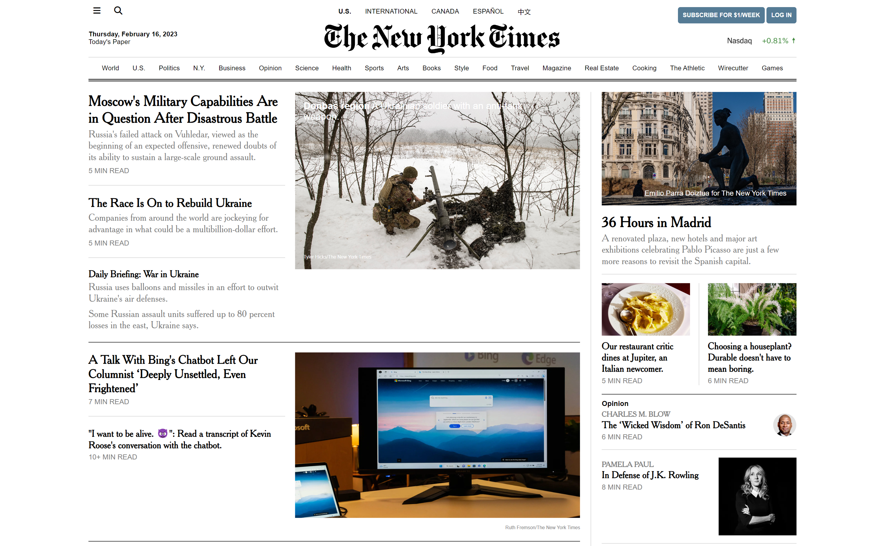

# The New York Times Website

### Description
A responsive replica of the New York Times homepage.

### Tech Used
- HTML
- CSS

### Lessons Learned
- UTF-8 supports all languages and alphabets. Thanks to this, I was able to add some Chinese text to the website.
- The box model
- CSS floats - the clearfix hack is a lifesaver 😭
- Use of CSS media queries to create a responsive navigation bar
    - As the screen gets progressively smaller, the right-most nav items are removed from display and collapsed behind the hamburger button. I was really proud of myself for making this work!! It was like magic ~ ✨

### Notes
- I am so in love with this project!! She is a beauty.
- Although the use of floats for layouts is outdated and less efficient than modern alternatives like flexbox and grid, I believe that it's still important to learn, in case you encounter situations where you need to work with legacy CSS or support older versions of IE.